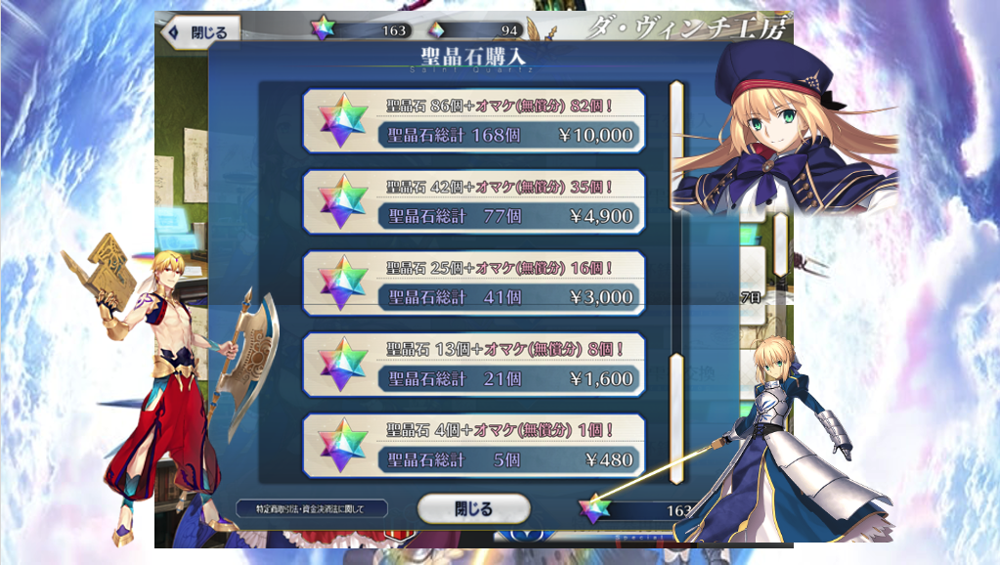

# FGO用課金計算アプリ AbyssGO

## アプリ概要

AbyssGOはFGOで課金をする際に利用できるCLIアプリケーションです。

FGOでの課金料金は画像のようになっており、天井までにかかる費用や、福袋購入時に損せず有償石を買う方法など、計算なしでは分かりにくくなっています。

AbyssGOは、欲しい聖晶石の個数と、所持している聖晶石の個数を入力することで、最適な課金パータンと課金費用を表示してくれます。

大切なお金を無駄にせず良きFGOライフを送るためにもぜひ活用してください！



## 実行例

課金後に所持したい聖晶石の個数と、現在所持している聖晶石の個数を入力することで、最適な課金パターンを出力することができます。

```
% ./abyssgo                                         
課金後に所持したい聖晶石の個数を入力してください: 900
現在所持している聖晶石の個数を入力してください: 156
******* 計算結果 *******
最低の値段: 44900円
得られる聖晶石の個数: 749個
購入パターン:
480円: 0回
1600円: 0回
3000円: 0回
4900円: 1回
10000円: 4回
```

`-p`オプションを使用することで、有償石のみの個数と課金額を計算することができます。

```
% ./abyssgo -p
欲しい有償石の個数を入力してください: 15
現在所持している有償石の個数を入力してください: 0
******* 計算結果 *******
最低の値段: 1920円
得られる有償石の個数: 16個
購入パターン:
480円: 4回
1600円: 0回
3000円: 0回
4900円: 0回
10000円: 0回
```

## 使い方

main.cppをコンパイルし、実行ファイルを実行してください。

コンパイル
```
clang++ -o abyssgo main.cpp -std=c++11
```

実行
```
./abyssgo
```
